# StayEasy - Plateforme de reservation de proprietes (Laravel)

Application web de reservation de logements avec deux espaces distincts:
- `Client`: consultation du catalogue, reservation de sejours, suivi des reservations, gestion du profil.
- `Admin`: gestion des proprietes, reservations, utilisateurs et suivi via un dashboard Filament.

## Sommaire

1. [Vue d'ensemble](#vue-densemble)
2. [Fonctionnalites](#fonctionnalites)
3. [Stack technique](#stack-technique)
4. [Architecture et roles](#architecture-et-roles)
5. [Parcours applicatif avec captures d'ecran](#parcours-applicatif-avec-captures-decran)
6. [Structure des donnees](#structure-des-donnees)

## Vue d'ensemble

Le projet est base sur Laravel 10, avec:
- une interface publique/client en Blade + Tailwind + Livewire,
- un back-office admin avec Filament v3,
- une logique de roles (`client` / `admin`) pour separer les acces.

## Fonctionnalites

### Cote client
- Affichage d'une page d'accueil avec une selection de proprietes.
- Consultation du catalogue complet.
- Consultation du detail d'un bien.
- Reservation d'un bien via un composant Livewire.
- Verification de conflit de dates (anti-double-reservation).
- Tableau "Mes reservations".
- Gestion du profil (infos, mot de passe, suppression du compte).

### Cote admin
- Authentification dediee au panel Filament (`/admin`).
- Dashboard avec:
  - statistiques globales,
  - evolution des reservations (graphique),
  - reservations a venir,
  - liste des proprietes.
- CRUD des proprietes.
- CRUD des reservations.
- CRUD des utilisateurs (avec role `admin` / `client`).

## Stack technique

- `PHP 8.1+`
- `Laravel 10`
- `Laravel Breeze` (auth)
- `Livewire 3`
- `Filament 3.3`
- `Tailwind CSS 3`
- `Vite`
- Base de donnees SQL (MySQL/MariaDB recommande)

## Architecture et roles

- Champ `role` ajoute dans la table `users` (`client` par defaut).
- Middleware `client`: bloque l'acces client pour les admins.
- Middleware `not_admin`: evite l'acces admin aux pages publiques/client.
- Les admins accedent au panel Filament uniquement si `role = admin`.

Routes principales:
- `/` : accueil (ou redirection selon le role)
- `/properties` : catalogue
- `/properties/{property}` : detail + reservation
- `/dashboard` : dashboard client
- `/mes-reservations` : reservations du client connecte
- `/admin` : panel admin Filament

## Parcours applicatif avec captures d'ecran

## 1) Decouverte du site (visiteur)

Page d'accueil:

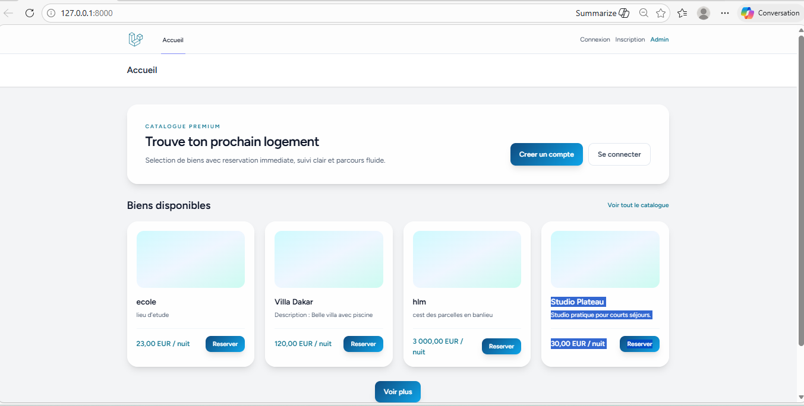

Vue d'ensemble des proprietes disponibles:

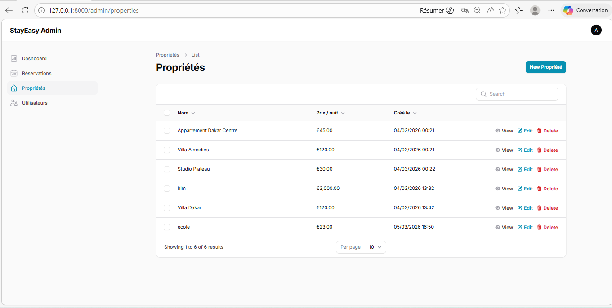

## 2) Authentification client

Inscription client:

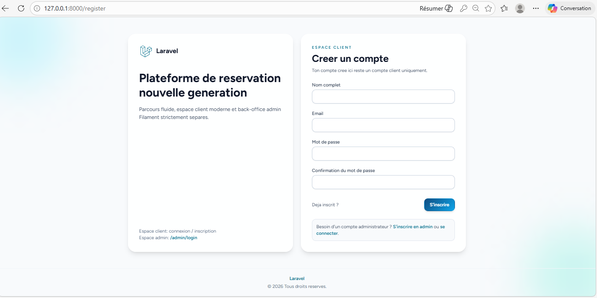

Connexion client:

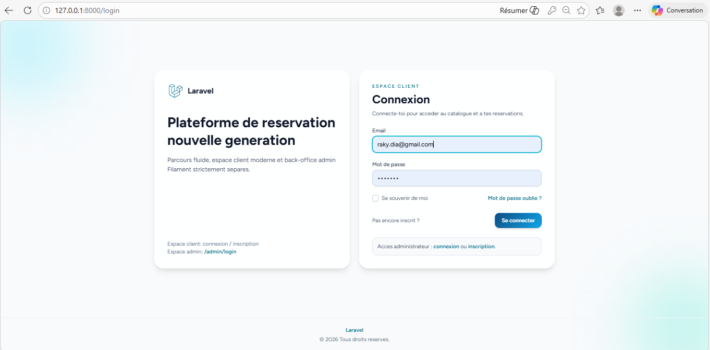

## 3) Espace client

Dashboard client:

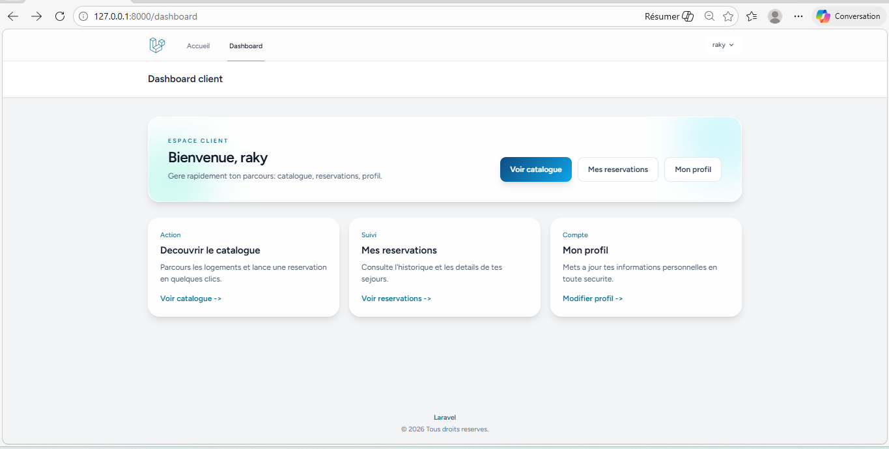

Profil client:

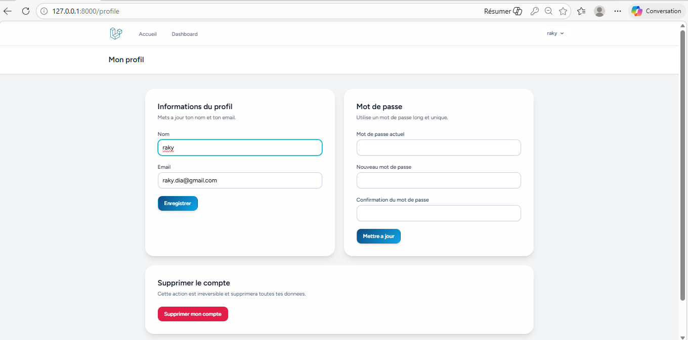

Reservation depuis la fiche d'un bien:

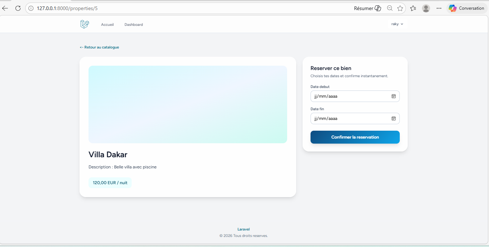

Creation d'une reservation:

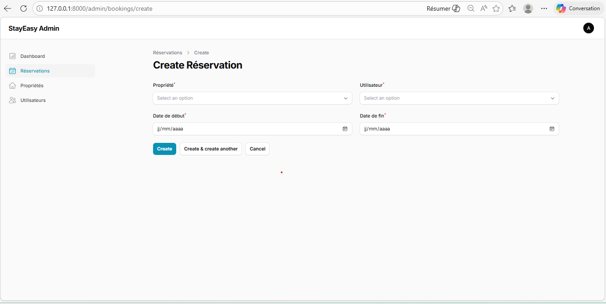

Suivi des reservations client:

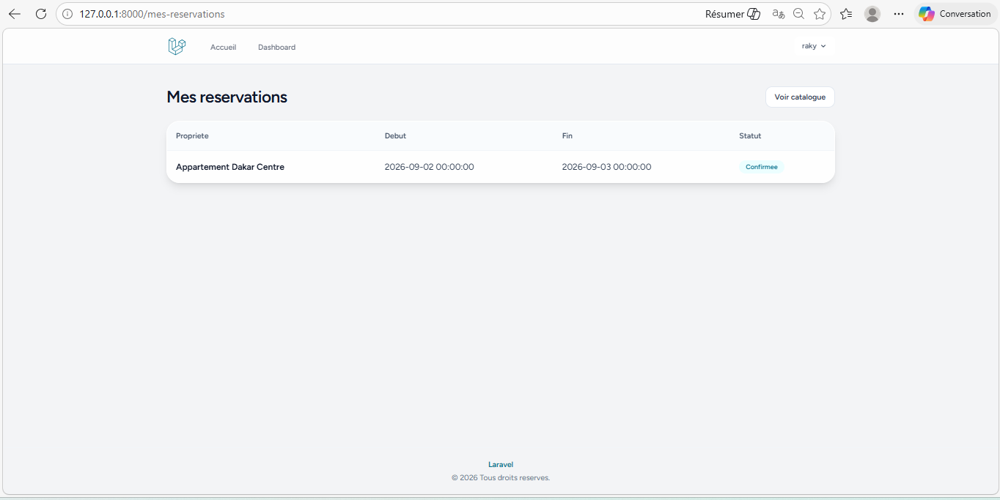

## 4) Authentification et dashboard admin

Connexion admin (Filament):

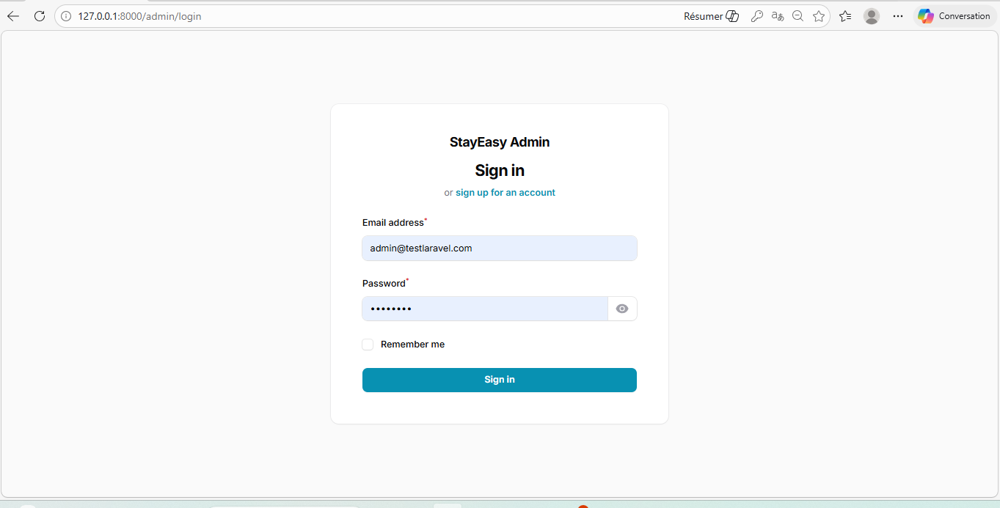

Dashboard admin - vue principale:

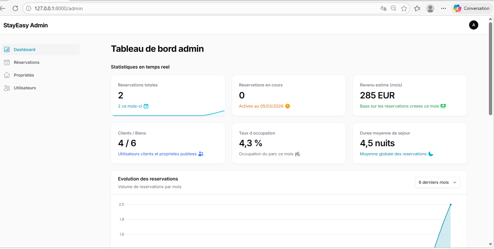

Dashboard admin - suite 1:

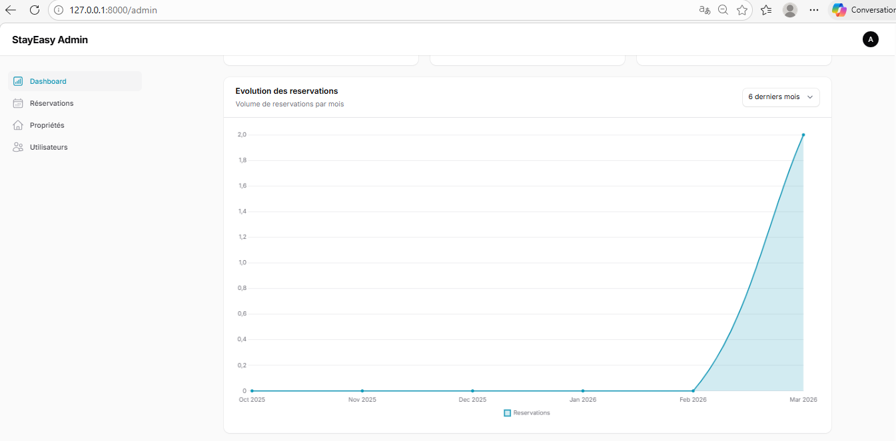

Dashboard admin - suite 2:

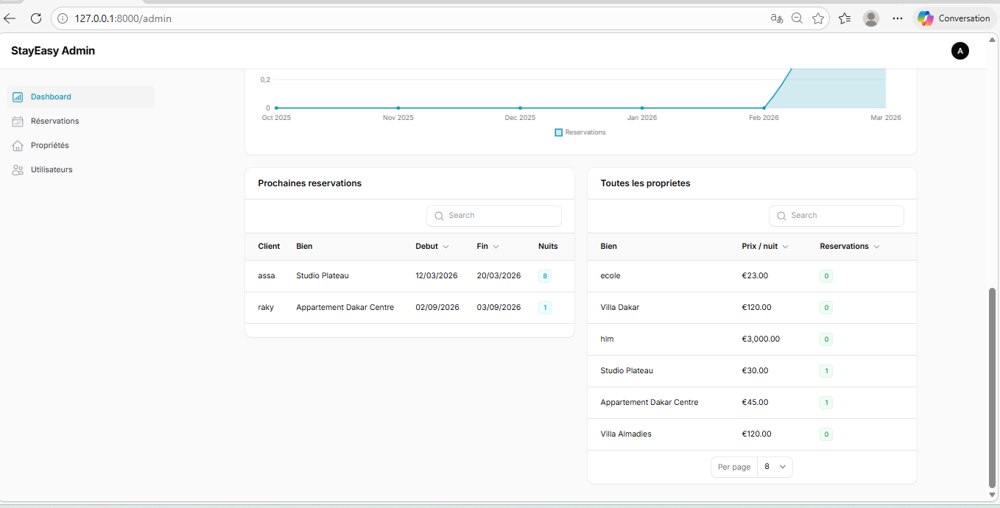

## 5) Gestion admin (CRUD)

Creation d'une propriete:

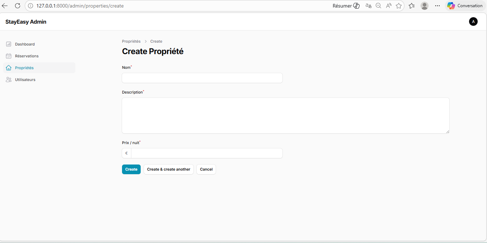

Vue de toutes les reservations:

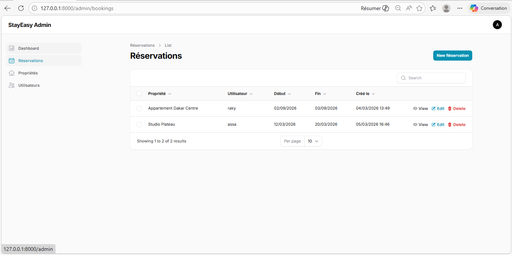

Vue de tous les utilisateurs:

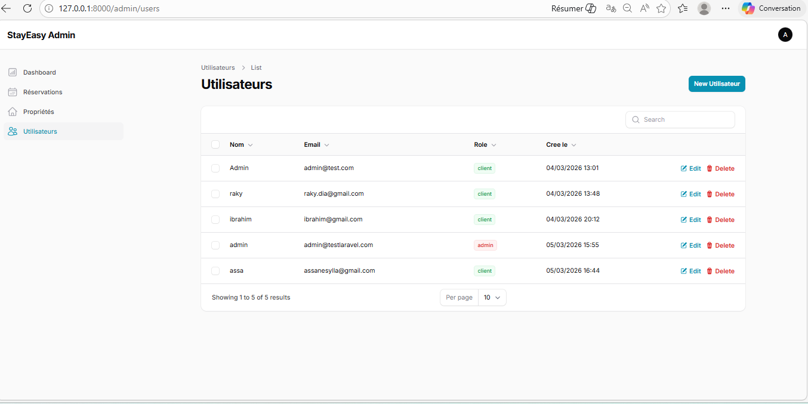

Creation d'un utilisateur cote admin:

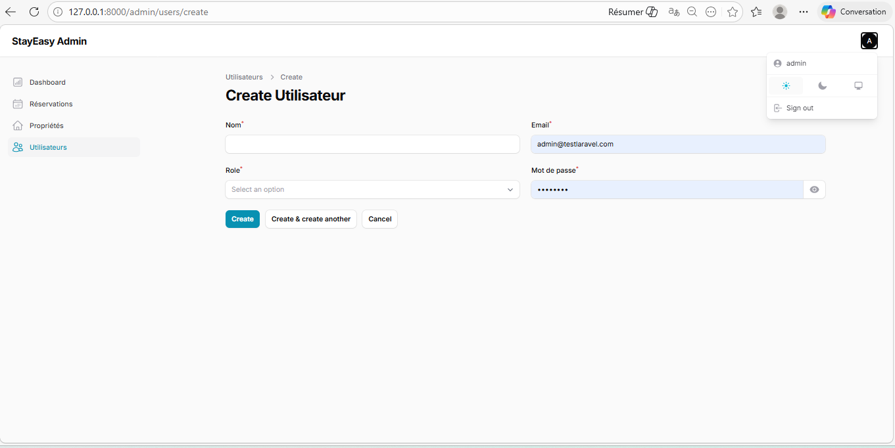

## Structure des donnees

Tables metier principales:
- `users` : informations utilisateur + `role` (`client` ou `admin`)
- `properties` : biens (`name`, `description`, `price_per_night`)
- `bookings` : reservations (`user_id`, `property_id`, `start_date`, `end_date`)

Relations:
- Un `User` possede plusieurs `Booking`.
- Une `Property` possede plusieurs `Booking`.
- Un `Booking` appartient a un `User` et a une `Property`.

---

Projet realise avec Laravel + Livewire + Filament pour une separation claire entre l'experience client et l'administration.

